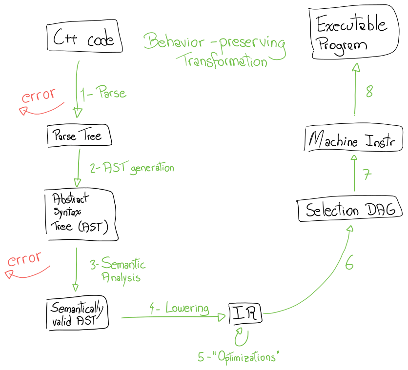

Intermediate Representations (IRs) are used by compilers to represent programs
throughout the compilation pipeline. To understand what an IR is, let's look at
what compilers do and how they are structured.

# Compilers and Transformations

In essence, a compiler takes a program written in some source language and
_transforms_ it into an executable program. This _transformation_ has a key
property: it preserves some kind of behavior.

For example, a program written in C++ describes what happens in some abstract
machine defined by the C++ standard. When the compiler _transforms_ this
program into a program for a real world machine, it must ensure that the real
world machine will behave like the C++ abstract machine does.

{style="display:block; margin: auto;"}

## Many Transformations

In reality, the compiler performs many such behaviour-preserving
_transformations_ before producing the final program, using different
representations along the way. Let's look at one possible flow that an
LLVM-based compiler may follow; don't worry about the names of each stage,
we're interested in the fact that they exist, and where the IR is located.

{style="display:block; margin: auto;"}

We start with the source program, and then we:

1. _Transform_ it into a Parse Tree.
   * Usually, this step can fail for ill-formed programs.
2. _Transform_ it into an Abstract Syntax Tree (AST).
3. _Transform_ it into a semantically valid AST.
   * Usually, this step can fail for ill-formed programs.
4. _Transform_ it into Intermediate Representation (IR).
5. _Transform_ it into equivalent IR.
   * Often referred to as "optimizations".
6. _Transform_ it into a Selection DAG.
7. _Transform_ it into sequence of machine instructions.
8. _Transform_ it into the final program.

The list is not comprehensive, especially in the later stages which I am not
familiar with; the important observation is the number of _transformations_,
and how __all__ of them must preserve behavior specified by each input
representation in the output representation.

While each representation in the list above is "intermediate" in the sense that
it is neither the input program nor the final executable, we usually take
Intermediate Representation to mean the IR generated in Step 4, "optimized"
(_transformed_) in Step 5, and lowered in Step 6.

## Different Languages, Same IR

Steps 1-5 are specific to the source language of the input program, but all
other steps are agnostic to the language; the IR is the first such agnostic
representation. Using this scheme, one can conceive different compilers that
all share the "middle" and "back"-ends of the sequence above:

{style="display:block; margin: auto;"}

A side-effect of a language-agnostic IR is that everything required by the
language specification must be captured using generic mechanisms provided by
the IR: the language specification doesn't exist in that level. Because of
this, one can inspect IR and understand how language concepts map to simpler
and low level code abstractions.

# Goals of the IR

In the compilation pipeline, the IR sits between representations specific to
source languages and representations specific to the target machine.

{style="display:block; margin: auto;"}

From where the IR is positioned in the compilation pipeline, we can derive some
of its design goals:

* It must be able to represent concepts from any high level language,
* It must be amenable to analysis required by "optimizing" transformations,
* It must be able to represent concepts required by target specific
representations.

{style="display:block; margin: auto;"}

LLVM's IR attempts to achieve these design goals by:

* Being a RISC-like language,
* Having a type system,
* Being highly configurable.

# Up Next

The next post in this series will dig into the core concepts of LLVM's IR!
