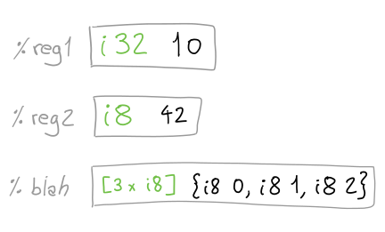
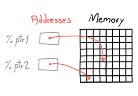

There are three key abstractions on top of which LLVM IR is built: values,
registers and memory.

## Values

In LLVM IR, **a `Value` is a piece of data described by a type**. For example,
the `Value` `42` of type 32-bit integer is written `i32 42`. This notion is so
important that we will be writing `Value` with a special font to emphasize that
this definition is being used.

There are two places where `Value`s may live: in a register or in memory.

## Registers

A register is an entity that holds exactly one `Value`. `Value`s are placed
into registers through instructions; once a register is assigned a value, its
`Value` - and also its type - never changes. As such, we say that a register is
**defined** when it is assigned a value.

A register will have a "size" big enough to hold its `Value` regardless of the
`Value`'s type; for example, a register may hold a single integer or even an
entire array.

Registers have _names_, and we use their _name_ to access the underlying `Value`.
Any name starting with the `%` symbol is the name of a register. For example:
`%0, %hi, %___` are all register names.

{style="display:block; margin: auto;"}

The exact name of a register carries no semantic meaning in the program,
therefore registers may be renamed at will.

When working with LLVM IR, we have access to infinitely many registers.

In this definition of registers, we see why the IR is in this intermediate
state of being a lower level abstraction, but not too low level; the concept of
a register is in itself a low level idea, but IR registers are infinite, may
have arbitrary sizes, and have a type, all of which are ideas of higher-level
languages.

## Memory

Memory is a sequence of bytes, each of which has an address. Addresses, also
known as pointers, are `Value`s and therefore may be placed into a register.
The type of an address is `ptr`.

{style="display:block; margin: auto; scale: 150%"}

`Value`s are typically moved from or to memory using loads or stores.

In this characterization, memory is _just_ a sequence of bytes. Memory does not
hold information about the types of `Value`s that were previously stored in it;
it is how we use memory addresses that give meaning (a type) to a sequence of
bytes. We will come back to this when we talk about instructions.

# Registers have Names, Memory has Addresses

Note the difference in the definition of registers and memory: registers have
names but not addresses (registers are _not_ memory locations). Memory does not
have names, it only has addresses.

This is a core principle, so excuse the repetition: to access a `Value` inside a
register, we use the _register's name_; to access a `Value` in memory, we
use its _memory address_, which may be placed into a register.


# Instructions

Having defined `Values`, registers, and memory, we're now ready to talk about
instructions.

An instruction is an operation that may have `Value`s as input, may define a
register as output, and may modify state in a program (like writing `Value`s to
memory). Each instruction has semantics describing the expected input, the
produced output and changes it makes to the program state ("side effects").

Here's an example instruction:

```llvm
  %result = add i32 10, %two
```

Its inputs are `i32 10` and `%two`, the latter being a register defined
previously. Its output is `%result`, which is a new register definition. The
`add` instruction sums the `Value` `i32 10` and the `Value` inside register
`%two`, placing the resulting `Value` into `%result`.

LLVM's type system is very strict, so the `add` instruction requires both
operands to be `Value`s of the same type; this is statically checked, and the
IR is invalid otherwise. In our example, the type of `i32 10` is spelled out
explicitly; to find the type of `%result`, we would need to check the
instruction that defined it. This is made possible because registers are
defined once and never allowed to change, so there is exactly one instruction
defining that register.

Instructions can also interact with memory:

```llvm
%address = alloca i32
store i32 %result, ptr %address
```

The `alloca i32` instruction allocates enough memory to contain an `i32` `Value`.
It returns a `Value` corresponding to the address of that memory location, and
that `Value` is placed in the register named `%address`. What is the type of this
`Value`? It is a pointer type: `ptr`. While we haven't yet talked about
`Functions`, the memory allocated by an `alloca` is automatically freed when
the `Function` exits.

The second instruction, `store i32`, does not produce a `Value`. It takes the
memory address in the register `%address`, an integer in the register
`%result`, and stores the integer into that memory location.

# Memory Does Not Have a Type!

Recall this paragraph from our memory definition:

> Memory does not hold information about the types of `Value`s that were
> previously stored in it; it is how we use memory addresses that give meaning
> (a type) to a sequence of bytes.

In the case of the `store i32` instruction, it interprets the input address as
a memory region containing a `Value` of type `i32`. In other words, the store
instruction gave meaning (a type) to that address.

If you're using a version of LLVM prior to April 2022, you may see pointer
types that carry a "base type" with them, like `i32*`. These are being phased
out, soon there will only be `ptr`.

# Up Next

In the next post, we will see how a program - functions and global variables -
is structured in LLVM's IR!

[next post]: ../llvm_ir_p3
